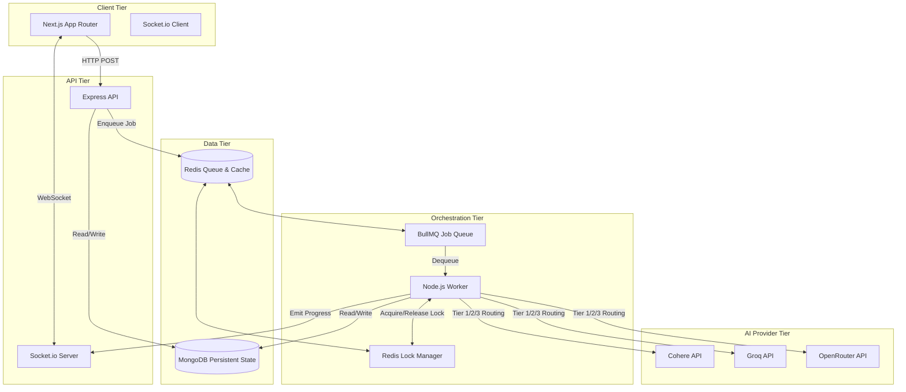
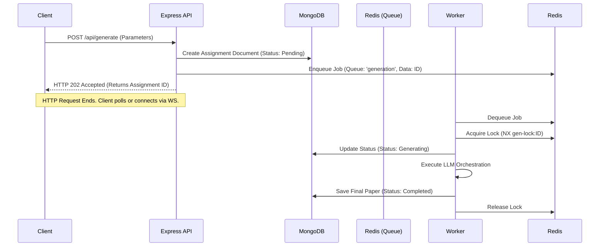
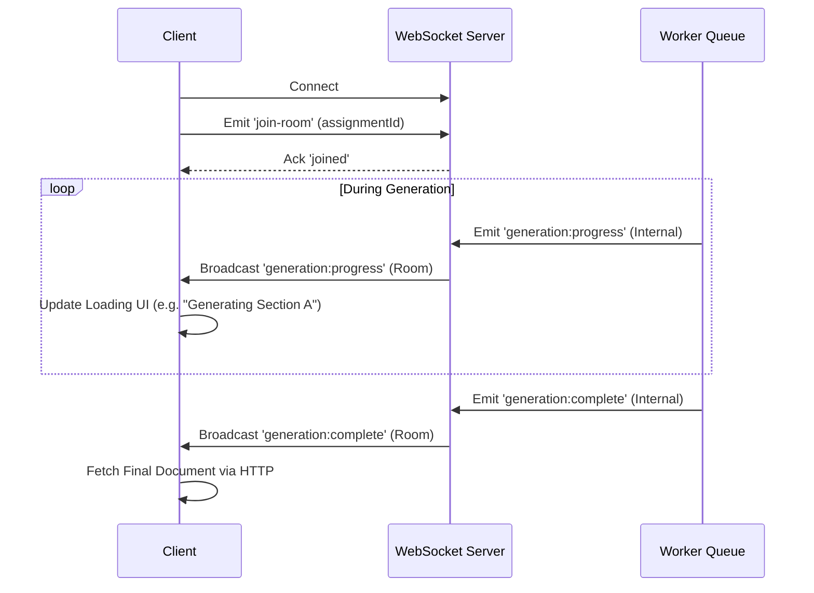
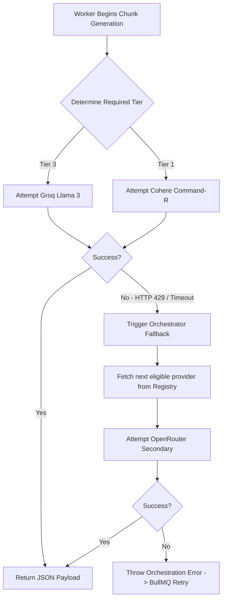
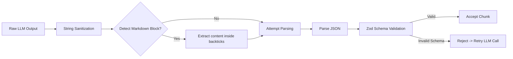
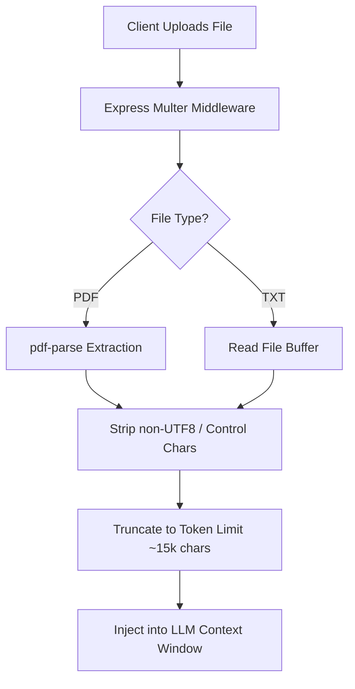
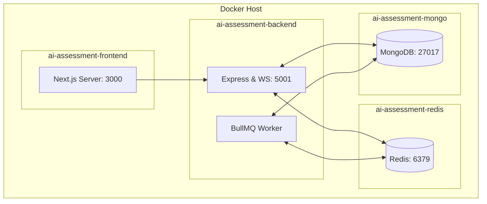

# AI Assessment Creator Architecture & Orchestration

This document outlines the architecture, orchestration lifecycle, and engineering design of the AI Assessment Creator. Built as an enterprise-grade platform, this system orchestrates multi-provider Large Language Models (LLMs) to generate pedagogically rigorous examinations asynchronously.

The architecture is explicitly decoupled to handle long-running, unpredictable generative AI workloads via message queues, persistent state locks, and real-time WebSocket synchronization.

---

## Table of Contents
1. [System Architecture Overview](#1-system-architecture-overview)
2. [Core Workflows & Request Lifecycle](#2-core-workflows--request-lifecycle)
3. [AI Provider Orchestration Strategy](#3-ai-provider-orchestration-strategy)
4. [Generation Performance & Timeouts](#4-generation-performance--timeouts)
5. [Structured Output Enforcement](#5-structured-output-enforcement)
6. [File Upload & Processing Pipeline](#6-file-upload--processing-pipeline)
7. [Docker & Deployment Topology](#7-docker--deployment-topology)
8. [Operational & Engineering Decisions](#8-operational--engineering-decisions)
9. [Setup & Development Environment](#9-setup--development-environment)
10. [Known Limitations & Scaling Considerations](#10-known-limitations--scaling-considerations)

---

## 1. System Architecture Overview

The system operates across three distinct planes: the client (Next.js), the API Gateway (Express), and the background processing tier (Node.js/BullMQ). State is persisted in MongoDB, while Redis handles transient job queues, rate limiting, and distributed locking.



---

## 2. Core Workflows & Request Lifecycle

Generative AI requests often exceed standard HTTP timeout thresholds (30s+). Therefore, generation is completely detached from the HTTP request cycle.

### 2.1 Async Job Enqueueing & Execution



### 2.2 Frontend-Backend WebSocket Synchronization

Because the HTTP request terminates immediately, the frontend relies on WebSockets for real-time progress hydration.



**Database Replication Lag Mitigation:**
Because the architecture uses a distributed MongoDB Replica Set, a Read-after-Write consistency race condition can occur when the WebSocket `completed` event triggers an instant HTTP GET request before the database fully syncs the completed state across nodes. 

To mitigate this, the frontend implements a **Retry with Exponential Backoff** architecture. If the fetched document returns a `processing` status immediately after a `completed` socket event, the client will wait 1,000ms and retry, ensuring perfect state reconciliation without requiring strict primary read preferences on the database.

### 2.3 Safe Deletion Orchestration

Hard deleting an assignment in a distributed architecture requires cleaning up state across multiple layers to prevent memory leaks and API cost bleeding. When `DELETE /api/assignments/:id` is called:

1. **Redis Cleanup**: The backend clears any active `gen-lock:ID` and `gen-run:ID` keys.
2. **BullMQ Termination**: The worker queue is queried for active or pending generation jobs (`gen-ID`). If found, the job is forcibly terminated (`job.remove()`), stopping any expensive LLM API calls mid-flight.
3. **MongoDB Deletion**: Finally, the document is securely purged from the primary database.
```

---

## 3. AI Provider Orchestration Strategy

Relying on a single LLM provider creates a single point of failure and wastes compute resources. The `LLMOrchestrator` implements cognitive-based model routing and automatic fallbacks.

### 3.1 Cognitive Tier Routing

Different question types demand different levels of reasoning:
- **Tier 3 (Lightning):** Groq (Llama 3). Used for MCQs and Short Answers. Generates hundreds of tokens per second.
- **Tier 2 (Moderate):** Gemma 2 / Mixtral. Used for Numerical Problems requiring basic math reasoning.
- **Tier 1 (Heavy):** Cohere (Command R) / Deepseek. Used for Long Answers and Diagram evaluation rubrics requiring deep synthesis.

### 3.2 Provider Fallback Execution



---

## 4. Generation Performance & Timeouts

Generating a full assessment requires massive token outputs. The backend is designed with strict performance budgets and safety mechanisms to handle this.

### 4.1 Token Generation Speeds & Chunking
- A typical 30-question MCQ paper requires outputting **~4,500 tokens**.
- Modern models (like Cohere Command R or Llama 3) generate at roughly **50 to 80 tokens per second**.
- If a user requests a single question type (e.g., just 30 MCQs), the `ChunkPlanner` groups it into a **single massive chunk**, taking **45 to 90 seconds** to complete.
- If multiple question types are requested, the planner breaks them into smaller sequential chunks, updating the UI progress incrementally.
- To prevent UI freezing during single massive chunks, the frontend utilizes an **Asymptotic Progress Simulation** that crawls the progress bar forward autonomously until the backend syncs.

### 4.2 The 3-Minute Hard Timeout & Abort Cascade
To protect server memory from hanging AI API requests, the orchestrator enforces a strict **3-minute (`180,000ms`) timeout** per chunk. 
If an AI provider (e.g., Cohere) experiences severe degradation and takes longer than 3 minutes, the following sequence occurs:
1. The orchestrator triggers an `AbortController`.
2. The primary request is instantly killed with a `"LLM request timed out"` or `"User aborted a request"` error.
3. The orchestrator attempts to cascade to fallback models (Deepseek, Llama, Gemma).
4. Because the global 3-minute timer has expired, the fallback models are instantly aborted in the same millisecond (`APIUserAbortError: Request was aborted`).
5. The `LLMOrchestrator` officially fails the attempt.
6. The background worker (BullMQ) catches the failure and **automatically schedules a full retry** (Attempt 2 of 3).

This mechanism ensures the system is self-healing and never permanently locks up during provider outages.

---

## 5. Structured Output Enforcement

LLMs are highly prone to injecting markdown wrappers (`````json ... `````) or conversational text around payloads, which breaks naive `JSON.parse()`.

### 4.1 Generation Pipeline



**Optimization Note (Answer Keys):** To drastically reduce output tokens, the prompt strategy conditionally instructs the LLM to completely omit the `correctAnswer` field for non-MCQ questions or College-level papers. The Zod validation schema strictly supports this optionality to prevent validation crashes.

---

## 6. File Upload & Processing Pipeline



---

## 7. Docker & Deployment Topology

The local development environment and production build utilize a containerized microservice approach.



---

## 8. Operational & Engineering Decisions

### 7.1 Why BullMQ and Redis?
- **Durability:** Standard `setTimeout` or `Promise.all` in Node.js disappears if the process crashes (e.g., OOM kill). BullMQ persists the job in Redis. If the server restarts, the job is dequeued and resumed.
- **Concurrency Control:** LLM APIs strictly rate-limit concurrent requests. BullMQ allows us to set exact concurrency limits across workers.

### 7.2 Redis State Locking
- **The Problem:** If a worker crashes midway through generation but BullMQ immediately retries the job while the original process is still somehow writing to DB, it causes race conditions (`ConcurrentRunError`).
- **The Solution:** Implemented distributed locking using Redis `SET key value NX PX ttl`. A worker must acquire the lock before generating. If the lock is held, the retry is aborted until the lock expires or is cleared.

### 7.3 Structured Output over Tools
- **Decision:** Rather than relying on fragile OpenAI Function Calling (which some OSS models on OpenRouter struggle with), the system injects a hardcoded JSON schema definition into the system prompt and utilizes Zod for backend enforcement. This guarantees cross-provider compatibility.

---

## 9. Setup & Development Environment

### 8.1 Prerequisites
- Node.js `v20+`
- Docker Engine `v24+` & Compose
- API Keys: Cohere, Groq, OpenRouter

### 8.2 Environment Configuration
Create `.env` in both `/backend` and `/frontend`.

**Backend (`/backend/.env`):**
```ini
PORT=5001
NODE_ENV=development
CLIENT_URL=http://localhost:3000
MONGODB_URI=mongodb://localhost:27017/ai-assessment
REDIS_URL=redis://localhost:6379
COHERE_API_KEY=your_key
GROQ_API_KEY=your_key
OPENROUTER_API_KEY=your_key
```

**Frontend (`/frontend/.env.local`):**
```ini
NEXT_PUBLIC_API_URL=http://localhost:5001/api
NEXT_PUBLIC_SOCKET_URL=http://localhost:5001
```

### 8.3 Bootstrapping Scripts

1. Start Infrastructure:
   ```bash
   docker-compose up -d
   ```
2. Start Backend API & Worker:
   ```bash
   cd backend && npm install && npm run dev
   ```
3. Start Frontend:
   ```bash
   cd frontend && npm install && npm run dev
   ```

---

## 10. Known Limitations & Scaling Considerations

- **State Lock Stalls:** If a Node process crashes violently without executing `finally` blocks, a Redis generation lock may persist. A manual flush (`DEL gen-lock:<id>`) is required.
- **Vector Search (RAG) Absence:** Currently, textbook uploads rely on a naive truncation strategy (15k characters). For large texts, a Vector Database (Pinecone/Milvus) should be introduced for semantic RAG injection.
- **Horizontal Scaling:** The backend currently runs the Express API and the BullMQ worker in the same process. To scale production horizontally, the worker logic should be decoupled into a standalone Docker image, allowing you to run 10x Worker containers independently of the API gateways.
